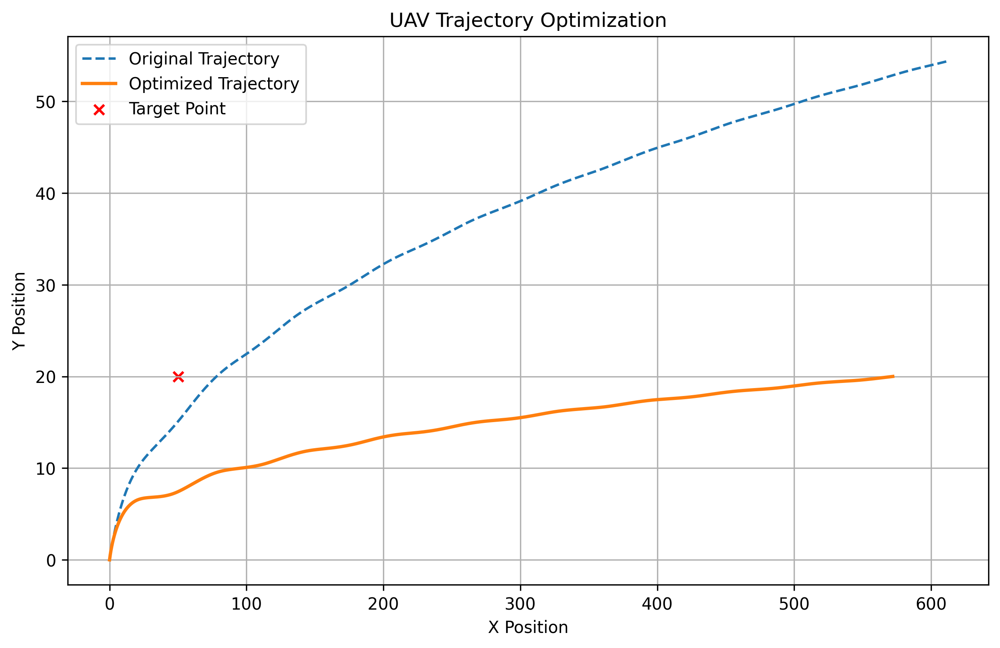

# UAV Trajectory Optimization Using Differential Equations

## Introduction
This project focuses on optimizing the flight path of an Unmanned Aerial Vehicle (UAV) using differential equations. The goal is to find an optimal trajectory that takes into account terrain, weather conditions, and energy efficiency constraints. By leveraging mathematical modeling, we can improve UAV navigation and performance while ensuring minimal energy consumption.

## Mathematical Formulation

### 1. UAV Flight Dynamics
The motion of a UAV can be described using differential equations that consider forces acting on the vehicle, including lift, drag, and thrust. The general equation of motion is given by:

\[ m \frac{d^2x}{dt^2} = F_{thrust} - F_{drag} \]
\[ m \frac{d^2y}{dt^2} = F_{lift} - mg \]

where:
- \( m \) = Mass of the UAV (kg)
- \( x, y \) = Position coordinates (m)
- \( F_{thrust} \) = Thrust force (N)
- \( F_{drag} \) = Aerodynamic drag force (N)
- \( F_{lift} \) = Lift force (N)
- \( g \) = Gravitational acceleration (9.81 m/s²)

### 2. Optimization Approach
The optimization process refines the trajectory to minimize energy consumption while ensuring smooth navigation. This is achieved by solving the equations of motion under given constraints and applying numerical optimization techniques.

- **Constraints Considered:**
  - Terrain restrictions to avoid collisions.
  - Weather factors like wind speed and turbulence.
  - Battery capacity for sustained flight duration.

- **Optimization Method:**
  - Solve differential equations using numerical integration.
  - Adjust trajectory iteratively to reduce energy expenditure.
  - Use gradient-based optimization for fine-tuning flight paths.

## Implementation Overview
1. Define UAV flight dynamics equations.
2. Incorporate terrain, weather, and energy constraints.
3. Use numerical solvers to compute UAV trajectory.
4. Apply optimization techniques to refine the flight path.
5. Visualize the original and optimized trajectory for comparison.

## Results
The optimized UAV trajectory reduces unnecessary energy expenditure while ensuring smooth navigation. The following plot shows the comparison between the original and optimized trajectories:

**Figure 1.1:** Comparison of original vs. optimized UAV flight paths.

## Conclusion
This project demonstrates how mathematical modeling and optimization techniques can improve UAV trajectory planning. By integrating real-world constraints, we achieve a more efficient and practical UAV flight path, making this approach valuable for applications in autonomous navigation and drone technology.

